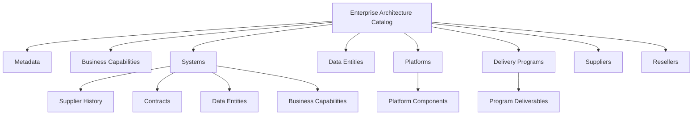
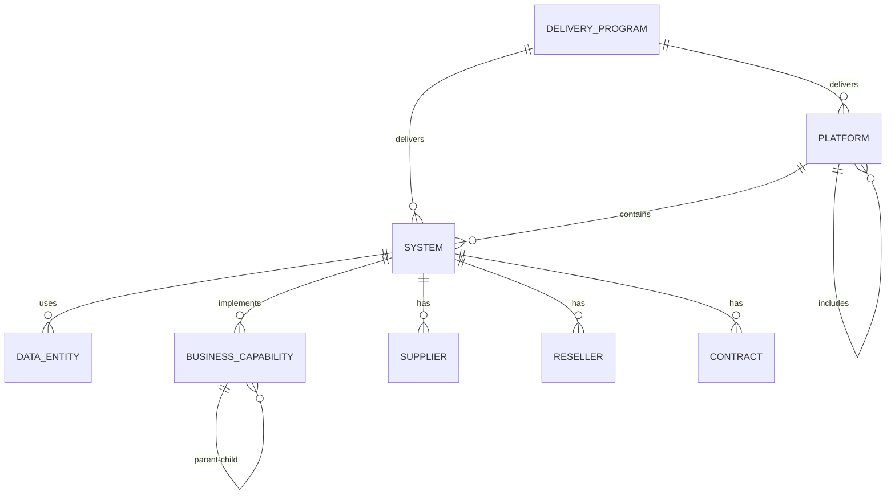
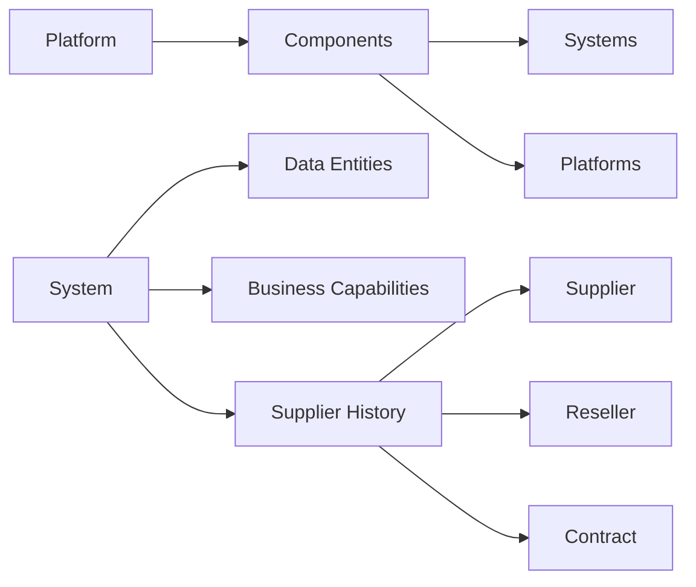

# Enterprise Architecture Catalog JSON Documentation

This document describes the structure and relationships within the `asis.json` file, which serves as the core data model for the Enterprise Architecture Catalog.

## Overview

The `asis.json` file represents a comprehensive enterprise architecture catalog that includes:
- Business capabilities
- Systems and applications
- Data entities
- Platforms
- Delivery programs
- Suppliers
- Resellers

## Structure



### Relationships Diagram



### Component Structure



## Important Notes

1. All dates in the JSON should be in UTC format with "Z" suffix (e.g., "2025-06-07T00:00:00Z")
2. Components can be nested (platforms can contain other platforms)
3. Systems must have at least one business capability and one data entity
4. Platforms can include both systems and other platforms
5. Supplier and reseller history is tracked per system as a list of contract periods

## JSON Schema

```json
{
  "$schema": "http://json-schema.org/draft-07/schema#",
  "type": "object",
  "required": ["metadata", "businessCapabilities", "systems", "dataEntities", "platforms", "deliveryPrograms", "suppliers", "resellers"],
  "properties": {
    "metadata": {
      "type": "object",
      "required": ["name", "description", "version", "lastUpdated"],
      "properties": {
        "name": { "type": "string" },
        "description": { "type": "string" },
        "version": { "type": "string" },
        "lastUpdated": {
          "type": "string",
          "format": "date-time",
          "description": "Must be in UTC format with Z suffix"
        }
      }
    },
    "businessCapabilities": {
      "type": "object",
      "patternProperties": {
        "^.*$": {
          "type": "object",
          "required": ["name", "description", "icon", "color"],
          "properties": {
            "name": { "type": "string" },
            "description": { "type": "string" },
            "icon": { "type": "string" },
            "color": { "type": "string" },
            "childrenIds": {
              "type": "array",
              "items": { "type": "string" }
            },
            "parentId": { "type": "string" }
          }
        }
      }
    },
    "systems": {
      "type": "object",
      "patternProperties": {
        "^.*$": {
          "type": "object",
          "required": ["name", "description", "status", "criticality", "deploymentType", "dataEntities", "businessCapabilities", "supplierHistory"],
          "properties": {
            "name": { "type": "string" },
            "description": { "type": "string" },
            "status": {
              "type": "string",
              "enum": ["Planning", "Development", "Testing", "Production", "Retired"]
            },
            "criticality": {
              "type": "string",
              "enum": ["Critical", "High", "Medium", "Low"]
            },
            "deploymentType": {
              "type": "string",
              "enum": ["SaaS", "Cloud", "OnPremise", "Hybrid"]
            },
            "dataEntities": {
              "type": "array",
              "minItems": 1,
              "items": { "type": "string" }
            },
            "businessCapabilities": {
              "type": "array",
              "minItems": 1,
              "items": { "type": "string" }
            },
            "supplierHistory": {
              "type": "array",
              "items": {
                "type": "object",
                "required": ["supplierId", "contractId", "contractValue", "startDate", "endDate"],
                "properties": {
                  "supplierId": { "type": "string" },
                  "resellerId": { "type": "string" },
                  "contractId": { "type": "string" },
                  "contractValue": { "type": "string" },
                  "startDate": { "type": "string", "format": "date" },
                  "endDate": { "type": "string", "format": "date" },
                  "notes": { "type": "string" }
                }
              }
            }
          }
        }
      }
    },
    "dataEntities": {
      "type": "object",
      "patternProperties": {
        "^.*$": {
          "type": "object",
          "required": ["name", "description", "classification"],
          "properties": {
            "name": { "type": "string" },
            "description": { "type": "string" },
            "classification": {
              "type": "string",
              "enum": ["Public", "Internal", "Confidential", "Sensitive"]
            },
            "icon": { "type": "string" },
            "color": { "type": "string" },
            "attributes": {
              "type": "array",
              "items": { "type": "string" }
            },
            "relationships": {
              "type": "array",
              "items": { "type": "string" }
            }
          }
        }
      }
    },
    "platforms": {
      "type": "object",
      "patternProperties": {
        "^.*$": {
          "type": "object",
          "required": ["name", "description", "category", "vendor"],
          "properties": {
            "name": { "type": "string" },
            "description": { "type": "string" },
            "category": {
              "type": "string",
              "enum": ["ApplicationPlatform", "DataPlatform", "IntegrationPlatform", "InfrastructurePlatform"]
            },
            "vendor": { "type": "string" },
            "components": {
              "type": "object",
              "properties": {
                "systems": {
                  "type": "array",
                  "items": { "type": "string" }
                },
                "platforms": {
                  "type": "array",
                  "items": { "type": "string" }
                }
              }
            },
            "systemIds": {
              "type": "array",
              "items": { "type": "string" }
            }
          }
        }
      }
    },
    "deliveryPrograms": {
      "type": "object",
      "patternProperties": {
        "^.*$": {
          "type": "object",
          "required": ["name", "description", "status", "startDate", "endDate", "deliverables", "projects"],
          "properties": {
            "name": { "type": "string" },
            "description": { "type": "string" },
            "status": {
              "type": "string",
              "enum": ["Planning", "InProgress", "Completed", "OnHold", "Cancelled"]
            },
            "startDate": {
              "type": "string",
              "format": "date-time",
              "description": "Must be in UTC format with Z suffix"
            },
            "endDate": {
              "type": "string",
              "format": "date-time",
              "description": "Must be in UTC format with Z suffix"
            },
            "budget": { "type": "string" },
            "sponsor": { "type": "string" },
            "projects": {
              "type": "object",
              "patternProperties": {
                "^.*$": {
                  "type": "object",
                  "required": ["name", "status", "startDate", "endDate", "cost"],
                  "properties": {
                    "name": { "type": "string" },
                    "description": { "type": "string" },
                    "status": {
                      "type": "string",
                      "enum": ["Planning", "InProgress", "Completed", "OnHold", "Cancelled"]
                    },
                    "startDate": { "type": "string", "format": "date-time" },
                    "endDate": { "type": "string", "format": "date-time" },
                    "cost": { "type": "string" },
                    "manager": { "type": "string" },
                    "metadata": {
                      "type": "object",
                      "properties": {
                        "objectives": { "type": "string" },
                        "stakeholders": { "type": "string" },
                        "notes": { "type": "string" }
                      }
                    }
                  }
                }
              }
            },
            "deliverables": {
              "type": "object",
              "properties": {
                "systems": {
                  "type": "array",
                  "items": { "type": "string" }
                },
                "platforms": {
                  "type": "array",
                  "items": { "type": "string" }
                }
              }
            },
            "milestones": {
              "type": "array",
              "items": { "type": "object" }
            }
          }
        }
      }
    },
    "suppliers": {
      "type": "object",
      "patternProperties": {
        "^.*$": {
          "type": "object",
          "required": ["name"],
          "properties": {
            "name": { "type": "string" },
            "contact": { "type": "string" },
            "email": { "type": "string" },
            "phone": { "type": "string" },
            "notes": { "type": "string" }
          }
        }
      }
    },
    "resellers": {
      "type": "object",
      "patternProperties": {
        "^.*$": {
          "type": "object",
          "required": ["name"],
          "properties": {
            "name": { "type": "string" },
            "contact": { "type": "string" },
            "email": { "type": "string" },
            "phone": { "type": "string" },
            "notes": { "type": "string" }
          }
        }
      }
    }
  }
}
```
